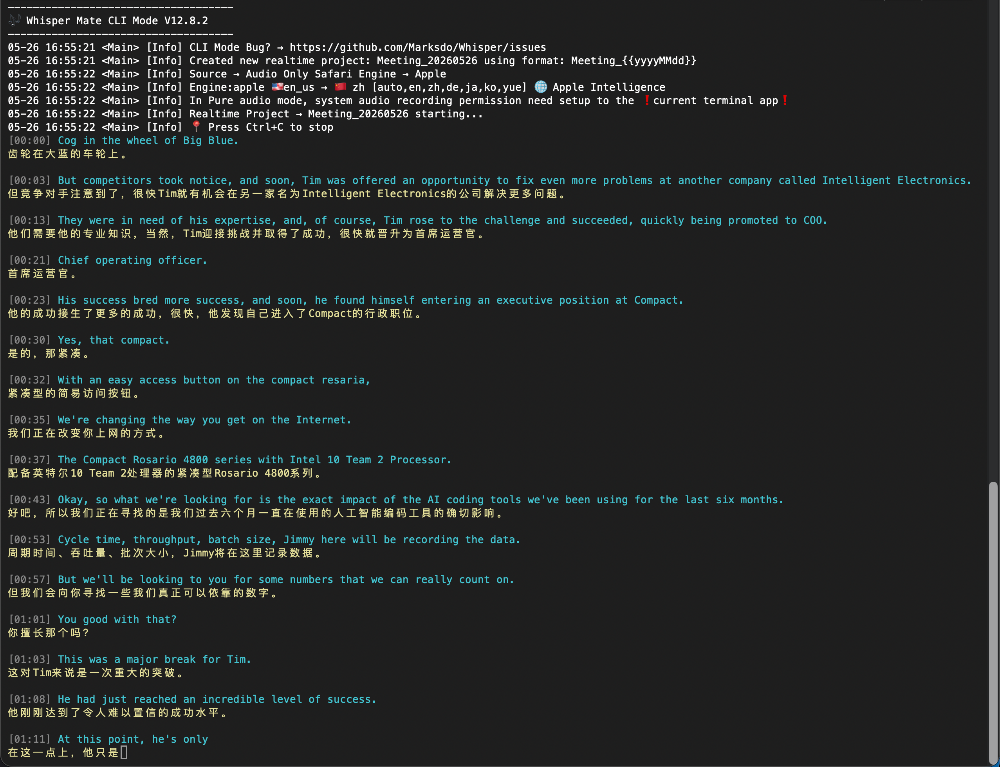

#  Homebrew-whispermate



Install WhisperMate from this Homebrew tap:

```shell
brew install --cask marksdo/whispermate/whispermate
```

## 🚀 CLI Usage

WhisperMate includes a handy command-line mode for transcribing media files, exporting subtitles, batch processing videos, and running realtime transcription workflows.

```shell
whispermate [options] -f <media file(s)>
# or
whispermate [options] -file <path>
```

### 🎧 Transcribe Files

```shell
# Automatically detect language and choose a suitable engine/model
whispermate -f elon.mp4

# Automatically select an engine for audio containing multiple languages
whispermate -f multi-langs.mp4 -lang auto

# Transcribe every MP4 file in the current folder
whispermate -f *.mp4

# Process multiple files explicitly
whispermate -f a.mp4,b.mp4,c.mp4

# Use a specific engine/model and export SRT
whispermate -f elon.mp4 -engine whispermlx -model v3-turbo -lang auto -o elon.srt

# Export with a subtitle/template preset
whispermate -f elon.mp4 -o elon.md -template Markdown

# Export with a specific template and output path
whispermate -f elon.mp4 -engine whisper.cpp -model v3-turbo -template srt -o elon.srt

# Let WhisperMate choose the output file name next to the media file
whispermate -f elon.mp4 -o

# Copy the exported text to the pasteboard after success
whispermate -f elon.mp4 -o elon.srt -copy

# Embed generated SRT as a soft subtitle track into the original video
whispermate -f elon.mp4 -embed-srt

# Use Apple Speech by language on macOS 26 when -model is omitted
whispermate -f meeting.m4a -engine apple -lang de

# Translate to the current macOS language
whispermate -f elon.mp4 -translate

# Print SRT to stdout and translate subtitles
whispermate -f elon.mp4 -engine whisper.cpp -srt -translate zh
```

### 🧰 Common Options

| Option | Description |
| --- | --- |
| `-f`, `-file <path[,path]>` | 🎬 Input media file or files. Shell-expanded files after `-f` are processed in order. Batch mode skips unsupported files. |
| `-engine <name>` | 🧠 Transcription engine, such as `whisper.cpp`, `whisperkit`, `parakeet`, `apple`, or `whispermlx`. |
| omit `-engine`/`-model` | 🪄 Auto-select for plain file projects. macOS 26 prefers Apple Speech when a locale model is available; otherwise CJK uses WhisperKit and European languages use Parakeet. |
| `-model <model-name>` | 📦 Model name for the selected engine when that engine needs one. Download/manage models in the WhisperMate app. |
| `-lang <code?>` | 🌐 Language code or `auto`. `-lang auto` means the file may contain multiple languages. For Apple Speech, omit `-model` and use `-lang en/zh/de/fr/...` to map to locale models such as `en_US`, `zh_CN`, `de_DE`, or `fr_FR`. |
| `-vad` | 🔇 Enable VAD for supported engines. |
| `-flash` | ⚡ Enable flash attention for `whisper.cpp`. |
| `-translate`, `-t <from?,to>` | 🌍 Translate subtitles with the active translation engine. If no value is provided, WhisperMate uses the current macOS language as the target when supported. If source and target match, specify a different target such as `-translate en,zh`. |
| `-diarization`, `-d` | 🗣️ Enable speaker diarization. |
| `-o`, `-output <path>` | 💾 Write output to a file. Supports template values like `{{date1}}`. |
| `-template <name>` | 📝 Export with a subtitle editor template/menu name. |
| `-copy` | 📋 After success, copy the exported text to the pasteboard. |
| `-player` | ▶️ Open the quick player after transcription. |
| `-editor` | ✏️ Open the subtitle editor after transcription. |
| `-silent` | 🤫 Do not print transcription text to stdout. |
| `-json` | 🧾 Print JSON output, for example `whispermate -f elon.mp4 -json > elon.json`. `-json` and `-template` are mutually exclusive. |
| `-srt` | 🎞️ Print SubRip output, for example `whispermate -f elon.mp4 -srt > elon.srt`. |
| `-embed-srt` | 📼 Embed generated SRT as a soft subtitle track into the original video. |
| `-h`, `-help` | 🙋 Show CLI help and exit. |

### 📂 Organize Projects

```shell
# Put the generated project into a matching sidebar group
whispermate -f meeting.mp4 -group Work

# Use a saved library preset by fuzzy name
whispermate -f meeting.mp4 -preset Podcast
```

| Option | Description |
| --- | --- |
| `-group <name>` | 🗂️ Assign the project to a sidebar group whose name contains the given text. |
| `-preset <name>` | 🎛️ Use a saved preset whose name contains the given text. |

### 🔴 Realtime Transcription

```shell
# Start with defaults: audio source, auto-selected realtime engine/model
whispermate -realtime

# Use Apple Speech by language on macOS 26 when -model is omitted
whispermate -realtime -lang en

# Translate realtime subtitles to the current macOS language
whispermate -realtime -translate

# Record system/app audio into a realtime project
whispermate -realtime meeting_044 -source audio -vout

# Translate realtime audio from English to Chinese
whispermate -realtime -engine whisper.cpp -model v3-turbo -source audio -translate en,zh

# Use Apple Speech with language mapping and translate French to English
whispermate -realtime -source audio -engine apple -lang fr -translate fr,en

# Monitor multiple keywords while translating
whispermate -realtime -source audio -engine apple -model en_us -translate en,ko -monitor money,돈

# Capture a target app and output video
whispermate -realtime -source app -engine apple -model en_us -translate en,zh -capture -vout

# Capture a named app
whispermate -realtime -source app -appname chrome -engine apple -model zh_cn -translate zh,en -capture

# Create a daily meeting project and stream latest subtitles for OBS
whispermate -realtime Meeting_{{yyyyMMdd}} -source audio -engine apple -model en_us -translate en,zh -vout -obs
```

| Option | Description |
| --- | --- |
| `-realtime <project-name>` | 🎙️ Start a realtime project. Missing projects are created automatically. |
| `-source <app,mic,audio>` | 🎚️ Set the realtime recording source. If omitted, realtime uses `audio` by default. |
| `-appname`, `-app <name?>` | 🪟 When `source=app` or `source=audio`, record all apps by default when no app is specified; otherwise record only the specified app. |
| `-capture <appname?>` | 🖥️ Capture a target app screen, or the full screen when no app is provided. Works with `source=app`. |
| `-engine <apple,whisper.cpp>` | 🧠 Set the realtime project engine. |
| `-model <model-name>` | 📦 Set the realtime project engine model. |
| omit `-engine`/`-model` | 🪄 Realtime auto-selects Apple Speech on macOS 26; older macOS versions use `whisper.cpp` with `v3-turbo`. With Apple Speech, `-lang en/zh/de/fr/...` maps to locale models such as `en_US`, `zh_CN`, `de_DE`, or `fr_FR`. |
| `-monitor <keyword>` | 🔔 Send notifications when transcription contains keywords. Use commas for multiple keywords. |
| `-vquality <0,1,2,3>` | 🎥 Video capture quality. `0` means best quality. |
| `-vsize <1,1/2,1/4>` | 📐 Capture screen size. |
| `-vout` | 📹 Output the result video to the current directory. Ensure parent directory permission is granted in UI mode. |
| `-nofile` | 🧾 Keep transcription only, without saving realtime media. |
| `-timestamp <0|false>` | ⏱️ Disable timestamp prefixes on each line. Timestamps are enabled by default. |
| `-statusbar` | 📊 Show a status bar below the active transcription line. Disabled by default. |
| `-obs <templateText?>` | 📡 Continuously write the latest subtitle content to a file for OBS. |
| `-log` | 🪵 Write confirmed lines to an hourly rotating plain-text log file. |

### 🧹 Model Tools

```shell
# List downloaded local models
whispermate -lsmodel

# Delete a specific local model
whispermate -delmodel -engine whisper.cpp -model v3-turbo
```

| Option | Description |
| --- | --- |
| `-lsmodel` | 🔎 Show all locally downloaded models for each engine. |
| `-delmodel` | 🗑️ Delete a model. Requires both `-engine` and `-model` to precisely specify which model should be removed. |

## ⬆️ Upgrade

```shell
brew update
brew upgrade --cask marksdo/whispermate/whispermate
```

## 🗑️ Uninstall

```shell
brew uninstall --zap whispermate
```
